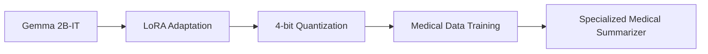

# 🏥 Fine-Tuning Gemma 2B for Medical Summarization

[](https://python.org)
[](https://huggingface.co/transformers)
[](LICENSE)
[](https://colab.research.google.com/github/somyajangir/Fine-Tuning-Gemma-2B-for-Medical-Summarization/blob/main/gemma2b_medical_summarization.ipynb)

> **A specialized medical text summarization model built by fine-tuning Google's Gemma 2B on clinical dialogue data**

This project demonstrates how to fine-tune **Gemma 2B**, Google's powerful open-source language model, specifically for **medical text summarization**. By leveraging parameter-efficient fine-tuning techniques, we create a model capable of generating concise, accurate, and domain-specific summaries of medical case reports and clinical notes.

---

## 🎯 Project Overview

### What This Project Accomplishes

- **🔬 Domain Adaptation**: Transforms a general-purpose LLM into a medical summarization specialist
- **💡 Efficient Training**: Uses LoRA and 4-bit quantization for resource-efficient fine-tuning
- **📊 Real-World Application**: Trained on clinical dialogue data for practical medical use cases
- **🚀 Production Ready**: Complete training pipeline with evaluation framework

### Key Features

- ✅ **Parameter-Efficient Fine-tuning** with LoRA (Low-Rank Adaptation)
- ✅ **Memory Optimization** through 4-bit quantization using bitsandbytes
- ✅ **Clinical Data Training** on MTS_Dialogue-Clinical_Note dataset
- ✅ **Comprehensive Pipeline** with automated training and evaluation
- ✅ **Easy Deployment** with Google Colab support

---

## 🛠️ Technical Stack

| Component | Technology | Purpose |
|-----------|------------|---------|
| **Base Model** | `google/gemma-2b-it` | Pre-trained instruction-tuned foundation |
| **Fine-tuning** | LoRA (PEFT) | Parameter-efficient adaptation |
| **Quantization** | 4-bit (bitsandbytes) | Memory optimization |
| **Dataset** | MTS_Dialogue-Clinical_Note | Clinical dialogue training data |
| **Framework** | Transformers, TRL, Accelerate | Training and inference pipeline |

---

## 📁 Repository Structure

```
Fine-Tuning-Gemma-2B-for-Medical-Summarization/
│
├── 📓 gemma2b_medical_summarization.ipynb   # Main notebook (training + evaluation)
├── 📋 requirements.txt                       # Dependencies  
└── 📖 README.md                              # Project documentation
```

---

## ⚡ Quick Start

### Prerequisites

- Python 3.8 or higher
- CUDA-compatible GPU (recommended)
- 8GB+ RAM (16GB+ recommended)

### Installation

1. **Clone the repository**
   ```bash
   git clone https://github.com/somyajangir/Fine-Tuning-Gemma-2B-for-Medical-Summarization.git
   cd Fine-Tuning-Gemma-2B-for-Medical-Summarization
   ```

2. **Create a virtual environment**
   ```bash
   python -m venv medical_summarization_env
   source medical_summarization_env/bin/activate  # On Windows: medical_summarization_env\Scripts\activate
   ```

3. **Install dependencies**
   ```bash
   pip install -r requirements.txt
   ```

### 🚀 Running the Project

#### Option 1: Local Jupyter Notebook
```bash
jupyter notebook gemma2b_medical_summarization.ipynb
```

#### Option 2: Google Colab (Recommended)
[](https://colab.research.google.com/github/somyajangir/Fine-Tuning-Gemma-2B-for-Medical-Summarization/blob/main/gemma2b_medical_summarization.ipynb)

Simply click the badge above to open the notebook directly in Google Colab with free GPU access.

---

## 🧠 Model Architecture & Training

### Base Model: Gemma 2B Instruction-Tuned

- **Parameters**: 2.51 billion
- **Architecture**: Transformer-based decoder
- **Pretraining**: Large-scale text corpus with instruction tuning
- **Strengths**: Strong reasoning, following instructions, code generation

### Fine-tuning Strategy



#### LoRA Configuration
- **Rank (r)**: 16
- **Alpha**: 32
- **Dropout**: 0.05
- **Target Modules**: q_proj, o_proj, k_proj, v_proj, gate_proj, up_proj, down_proj
- **Task Type**: CAUSAL_LM

#### Training Parameters
- **Learning Rate**: 2e-4
- **Batch Size**: 1 (per device)
- **Gradient Accumulation Steps**: 16
- **Epochs**: 1
- **Max Sequence Length**: 1024 tokens
- **Optimization**: paged_adamw_8bit
- **Save Strategy**: epoch

---

## 📊 Dataset & Training Approach

### MTS_Dialogue-Clinical_Note Dataset

- **Format**: Dialogue-style clinical conversations
- **Domain**: Various medical specialties  
- **Quality**: Professional clinical dialogue-summary pairs
- **Purpose**: Training the model to understand medical context and generate appropriate summaries

### Training Methodology

The model learns to transform clinical dialogues into concise, medically accurate summaries by:
- **Understanding Context**: Recognizing medical terminology and patient-doctor interactions
- **Extracting Key Information**: Identifying symptoms, duration, and relevant clinical details
- **Generating Summaries**: Producing professional medical documentation format

---

## 🔮 Future Work

* Extend to other tasks like **medical question answering**
* Train on larger and more diverse clinical datasets  
* Deploy as an API or web app for real-world use
* Explore multi-modal capabilities combining text and medical imaging

---

## 🤝 Contributing

We welcome contributions from the medical AI community! Here's how you can help:

### Ways to Contribute

1. **🐛 Bug Reports**: Found an issue? Please open a GitHub issue
2. **💡 Feature Requests**: Have ideas for improvements? Let us know!
3. **📊 Dataset Contributions**: Share additional medical datasets for training
4. **🔧 Code Improvements**: Submit pull requests for optimizations
5. **📖 Documentation**: Help improve our documentation and examples

### Development Setup

1. Fork the repository
2. Create a feature branch: `git checkout -b feature-name`
3. Make your changes and add tests
4. Submit a pull request with a clear description

---

## 📜 License & Citation

### License

This project is licensed under the MIT License. See [LICENSE](LICENSE) file for details.

---

## 🙏 Acknowledgements

We express our gratitude to the following:

- **🏗️ Google DeepMind** for open-sourcing the Gemma model family
- **🤗 Hugging Face** for the transformers library and model hub infrastructure
- **🔬 Medical Community** who contributed to the MTS_Dialogue-Clinical_Note dataset
- **⚡ Microsoft** for the PEFT library enabling parameter-efficient fine-tuning
- **🧮 Tim Dettmers** for the bitsandbytes quantization library
- **👥 Open Source Community** for continuous feedback and improvements

---

## 📞 Contact

- **📧 Email**: somyajangir21@gmail.com
- **💬 Discord**: som_verse_21

---

<div align="center">

**⭐ If this project helped you, please consider giving it a star!**

[](https://github.com/somyajangir/Fine-Tuning-Gemma-2B-for-Medical-Summarization)
[](https://github.com/somyajangir/Fine-Tuning-Gemma-2B-for-Medical-Summarization/fork)

</div>

---

<p align="center">
  <strong>Built with ❤️ for the medical AI community</strong><br>
  <sub>Making healthcare documentation smarter, one summary at a time</sub>
</p>
